# Algorithm Analysis

## 2n * 2 Sequential

| Cache Line Size  | Cache Blocks  | Algorithm | Memory Access Count  | Cache Hits  | Cache Hit Rate   | Cache Miss  | Cache Miss Rate   | Avg Access Time (ns) | Total Access Time (ns) |
| ----- | ------- | --------- | ------ | ----- | ------- | ----- | -------- | ------- | -------- |
| 4     | 8       | BSA + LRU | 32     | 0     | 0.00%   | 32    | 100.00%  | 42.00   | 1440.00  |
| 4     | 8       | BSA + MRU | 32     | 8     | 25.00%  | 24    | 75.00%   | 31.75   | 1112.00  |
| 4     | 16      | BSA + LRU | 64     | 0     | 0.00%   | 64    | 100.00%  | 42.00   | 1440.00  |
| 4     | 16      | BSA + MRU | 64     | 16    | 25.00%  | 48    | 75.00%   | 31.75   | 1112.00  |
| 4     | 32      | BSA + LRU | 128    | 0     | 0.00%   | 128   | 100.00%  | 42.00   | 1440.00  |
| 4     | 32      | BSA + MRU | 128    | 32    | 25.00%  | 96    | 75.00%   | 31.75   | 1112.00  |

_Fig 1. Tabular results of 2n * 2 Sequence_

In this sequence, it can be observed that BSA + LRU does not make any hits when loading a cache block because of the nature of its algorithm where it replaces the oldest (by age) or least used cache block. Since the given is 2n * 2 where n is the number of cache blocks and 2n is more than the number of cache blocks, the first quarter of the sequence will always be overridden by the second quarter of the sequence.

For example, if n = 4, the pattern generated would be [0, 1, 2, 3, 4, 5, 6, 7, 0, 1, 2, 3, 4, 5, 6, 7] and with the cache blocks also equal to 4 in a 4-way BSA algorithm, that means there will be 2 blocks assigned per 1 cache block in a set. This can be visualized by the table below:

|          | Way 0    | Way 1    | Way 2    | Way 3    |
| -------- | -------- | -------- | -------- | -------- |
| Set 0    | 0, 4     | 1, 5     | 2, 6     | 3, 7     |

As confirmed by running the simulation, the first quarter of the sequence [0, 1, 2, 3] will be overridden by second quarter of the sequence [4, 5, 6, 7]. Thus, all of the first half of the sequence [0, 1, 2, 3, 4, 5, 6, 7] will miss. Finally, repeating the sequence also yields the same result which means that the all 16 cache block calls miss. Thus, no cache blocks will ever hit in this scenario.

For this sequence to have a hit, it is recommended to have the cache blocks equal or more than n because this means that not all cache blocks in the set will be overcrowded by multiple blocks. For example, if n = 4 and cache blocks = 8 in a 4-way BSA, then each set can evenly distribute the two blocks available. The table can be visualized in this way:

|          | Way 0    | Way 1    | Way 2    | Way 3    |
| -------- | -------- | -------- | -------- | -------- |
| Set 0    | 0        | 1        | 2        | 3        |
| Set 1    | 4        | 5        | 6        | 7        |

On the other hand, the BSA + MRU will always have a 25% hit rate. This is due to MRU’s replacement algorithm where it replaces the most recently used cache block in the set. This method keeps the other neighboring cache blocks untouched. Thus, by the time the repetition comes in, it will hit the first few untouched blocks first before it starts replacing the most recently used block again when it starts missing.

As can be observed in the simulation where n = 4, it will hit n times because the repetition sequence assures that the untouched blocks will always be checked before it starts replacing one block again. The table demonstrates this sequence:

|          | Way 0    | Way 1    | Way 2    | Way 3                 |
| -------- | -------- | -------- | -------- | --------------------- |
| Set 0    | 0        | 1        | 2        | ~3~, ~4~, ~5~, ~6~, 7 |

During the repetition cycle, it will hit [0, 1, 2] before it starts replacing Set 0, Way 2 because it’s the most recently used block for when block 2 was hit. Then it starts having cache hits again until the next sequence ends. This can be shown in the table below where [7] is hit.

|          | Way 0    | Way 1    | Way 2                 | Way 3    |
| -------- | -------- | -------- | --------------------- | -------- |
| Set 0    | 0        | 1        | ~2~, ~3~, ~4~, ~5~, 6 | 7        |

Overall, BSA + MRU has a better performance than BSA + LRU for this 2n * 2 sequence with a consistent 23% difference. The patterned cache block calls allow the MRU to somehow anticipate previously called cache blocks by retaining a few blocks and essentially replacing only one block per set. BSA + LRU has the disadvantage of replacing most of the blocks in the set during the first cycle which essentially erases the history of the cache. It then replaces it with new data which will then be overridden again during repetition. Thus, no hits can happen which results to a higher average and total access time compared to its MRU counterpart.

## Mid Repeat 2x

| Cache Line Size  | Cache Blocks  | Algorithm | Memory Access Count  | Cache Hits  | Cache Hit Rate   | Cache Miss  | Cache Miss Rate   | Avg Access Time (ns) | Total Access Time (ns) |
| ----- | ------- | --------- | ------ | ----- | -------- | ----- | -------- | ------- | -------- |
| 4     | 8       | BSA + LRU | 46     | 14    | 30.43%   | 32    | 69.57%   | 29.52   | 1496.00  |
| 4     | 8       | BSA + MRU | 46     | 20    | 43.48%   | 26    | 56.52%   | 24.17   | 1250.00  |
| 4     | 16      | BSA + LRU | 94     | 30    | 31.91%   | 64    | 68.09%   | 28.91   | 3000.00  |
| 4     | 16      | BSA + MRU | 94     | 42    | 44.68%   | 52    | 55.32%   | 23.68   | 2508.00  |
| 4     | 32      | BSA + LRU | 190    | 62    | 32.63%   | 128   | 67.37%   | 28.62   | 6008.00  |
| 4     | 32      | BSA + MRU | 190    | 86    | 45.26%   | 104   | 54.74%   | 23.44   | 5024.00  |

_Fig 2. Tabular results of Mid Repeat 2x Sequence_

Mid Repeat 2x Sequence creates a sequence that assures that a portion of the quarter sequence will be hit before getting replaced by new blocks. For example, if n = 4, it creates a half sequence of [0, 1, 2, 3, 1, 2, 3, 4, 5, 6, 7] which will then be repeated. This information is important as it determines the cache blocks that will always hit and which ones will be replaced.

For BSA + LRU, it assures that the repeated middle section of the sequence is hit before it gets replaced by new cache blocks. This is visualized through this table:

|          | Way 0    | Way 1       | Way 2       | Way 3       |
| -------- | -------- | ----------- | ----------- | ----------- |
| Set 0    | ~0~, 4   | ~1~, ~1~, 5 | ~2~, ~2~, 6 | ~3~, ~3~, 7 |

In this sequence, the middle portion 1 to n-1 [1, 2, 3] gets hit first before the set gets replaced by the latter sequence of [4, 5, 6, 7]. This suggests that doing this pattern twice will yield a total of 6 hits for this sequence example. This happens because the cache blocks that are repeated are still within n blocks which means those blocks are not overridden yet until the latter quarter of the sequence.

For BSA + MRU it hits a few more blocks than its LRU counterpart for the same reason of having a better “foresight” of replacing the data of one cache block. This table visualizes how BSA + MRU retains some cache blocks and anticipates more repeated calls:

|          | Way 0    | Way 1   | Way 2   | Way 3       |
| -------- | -------- | ------- | ------- | ----------- |
| Set 0    | 0        | 1, 1    | 2, 2    | ~3~, ~3~, ~4~, ~5~, ~6~, 7 |

It then repeats the process hitting the first and last cache blocks of the sequence. This process adds a few more hits compared to LRU because of hitting the repeated middle cache blocks [1, 2, 3] but also the first and last cache blocks that are not replaced [0, 7]. This table demonstrates how BSA + MRU does it for this example:

|          | Way 0    | Way 1       | Way 2                      | Way 3   |
| -------- | -------- | ----------- | -------------------------- | ------- |
| Set 0    | 0        | ~1~, ~1~, 2 | ~2~, ~3~, ~3~, ~4~, ~5~, 6 | 7       |

As shown above, BSA + MRU algorithm continues to support the evidence of being an exemplary algorithm when provided a patterned sequence. Even though its LRU counterpart hits a few blocks, the replacement of the multiple cache blocks remains a problem because it erases the history of the cache block in essence and puts in a new one which the pattern will not hit during the repetition of the sequence. 

Thus, as observed in the comparison table, there is still a margin of difference in their average and total access time across varying number of cache blocks. BSA + MRU consistently exceeds the difference in the access time by 16%.

## Random (64 blocks)

| Cache Line Size  | Cache Blocks  | Algorithm | Memory Access Count  | Cache Hits  | Cache Hit Rate   | Cache Miss  | Cache Miss Rate   | Avg Access Time (ns) | Total Access Time (ns) |
| ----- | ------- | --------- | ------ | ----- | -------- | ----- | -------- | ------- | -------- |
| 4     | 8       | BSA + LRU | 64     | 0     | 0.00%    | 64    | 100.00%  | 42.00   | 2880.00  |
| 4     | 8       | BSA + MRU | 64     | 0     | 0.00%    | 64    | 100.00%  | 42.00   | 2880.00  |
| 4     | 16      | BSA + LRU | 64     | 1     | 1.56%    | 63    | 98.44%   | 41.36   | 2839.00  |
| 4     | 16      | BSA + MRU | 64     | 2     | 3.13%    | 62    | 96.88%   | 40.72   | 2798.00  |
| 4     | 32      | BSA + LRU | 64     | 1     | 1.56%    | 63    | 98.44%   | 41.36   | 2839.00  |
| 4     | 32      | BSA + MRU | 64     | 2     | 3.13%    | 62    | 96.88%   | 40.72   | 2798.00  |

_Fig 3. Tabular results of Random (64 blocks) Sequence_

For both BSA + LRU and BSA + MRU, there is really no significant difference between the results of their average and total access times since there is really no predictor or pattern on which cache block will be called next. With a memory block set at 1024 (210) main memory block, there is a 1/210 or less than 1% chance that the same cache block will be called twice.

BSA + MRU algorithm’s usual observed anticipatory behavior is also rendered unserviceable at this scenario because it all comes down to having the same chances as its LRU counterpart. Erasing the entire cache block and replacing them with new data has the same odds as erasing one cache block. Both scenarios essentially wait for a repeat cache block call to occur where randomization cannot assure. 

Thus, in this sequence, both average and total access times are closer in value with 0-1% difference. This is essentially dependent on how “lucky” one algorithm is in getting a repeat cache block call that is still stored in the cache.

## Conclusion

To summarize, BSA + MRU has a better performance compared to BSA + LRU for patterned sequences like sequential and mid-repeat sequences. The comparison table demonstrates the difference in average and total access time by a margin of 16-23% with the highest performance gained for the 2n * 2 sequential sequence. It leverages MRU’s replacement algorithm which minimizes the replaced blocks per set creating an observed anticipatory behavior for repeated calls. However, both LRU and MRU algorithms almost have the same performance with minimal differences or gains for completely randomized sequences within a large number of main memory blocks.

# Website Features

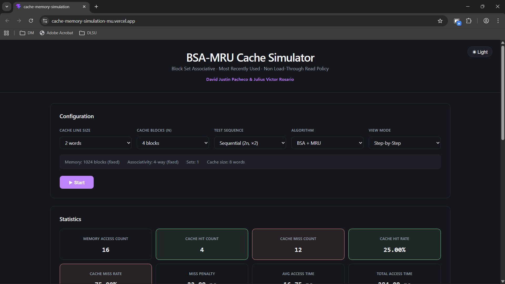

## Config

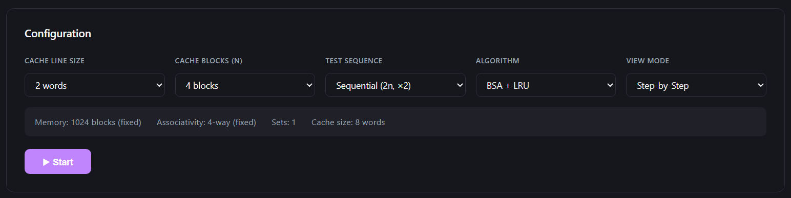

This contains the settings that will be used for the cache simulation. Users can set the Cache Line Size, Cache Blocks, Test Sequence, Algorithm and View Mode here before starting the simulation.

### Config Cache Line Size

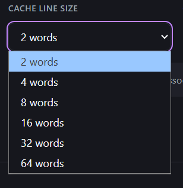

Available in from 2 to 64 words which affects the miss penalty and the access time calculations of the simulation.

### Cache Blocks

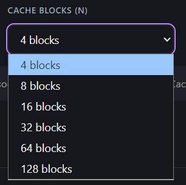

This usually determines n for the simulation patterns and how the blocks will be in sets of 4. Available from 4 to 128 blocks.

### Test Sequence

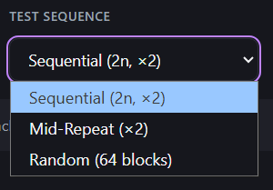

This sets the test case sequence that will be used for the simulation. Available ones are Sequential (2n, x2) where n is the number of cache blocks set, Mid Repeat Sequence (x2) which also depends on the cache blocks set and Random (64 blocks) which is a fixed 64 block call from 1024 main memory blocks set as a constant.

### Algorithm

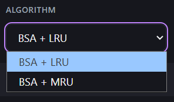

This determines which cache algorithm will be used for the simulation. Available in BSA + LRU and BSA + MRU.

### View Mode

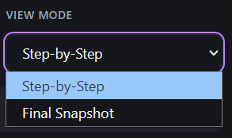

Two view modes are available: Step-by-Step which allows the user to see the cache blocks call one by one from start to end of the simulation and Final Snapshot which allows the user to just see the result of teh cache at the end of the simulation.

### Constants

This section shows the constant variables for the simulation including: Main Memory Block = 1024 blocks, Associativity = 4-way, Sets = automatically updated depending on the number cache blocks set by the users and Cache Size = automatically updated depending on the cache line size and cache blocks set. These are used for the calculation of the stats and for the test sequence.

## Stats

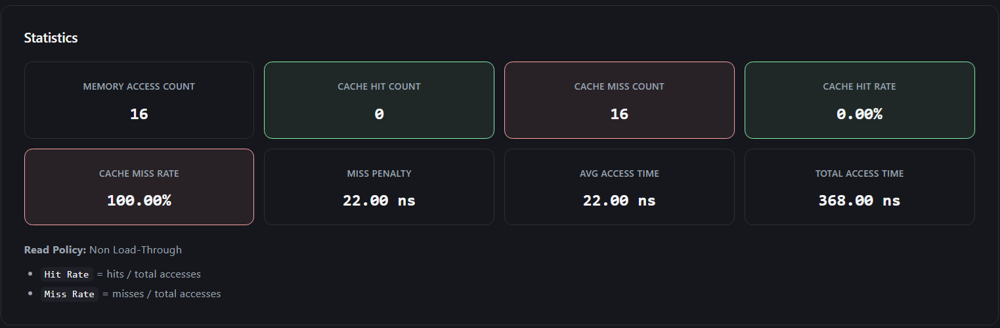

This shows the current state of the cache simulation with the number memory accesses, cache hits, cache misses, cache hit rate and cache miss rate. This also has the calculation for the miss penalty dependent on the cache line size, average access time and total access time.

## Cache Simulator

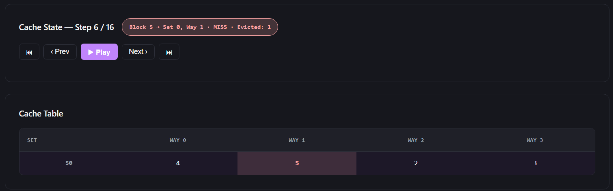

This simulates the memory accesses, cache hits and cache misses of the sequence. If users are in Step-by-Step mode, they have the ability to scrub through the simulation using the controls provided.

### Cache State

This shows the current step of the cache simulation, the feedback log on whether the access was a cache hit or miss, where the block is stored and during misses, it also shows which cache block got evicted.

### Controller

If users are in Step-by-Step mode, this will be available for them to take control on when to pause, play, move forward, move backward, move to start and move to end in the simulation sequence.

### Cache Table

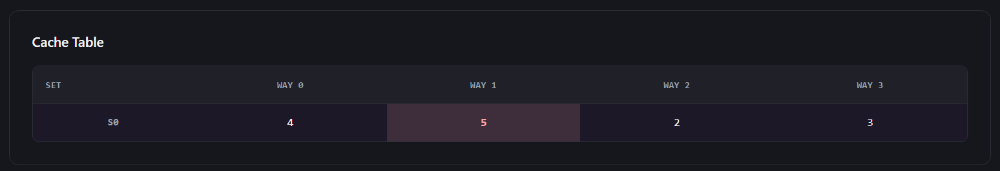

This is the simulated cache with the sets and the blocks labelled as Sets on the first column and Ways on the first row. This shows how the blocks get accessed and replaced. The result should be the final snapshot of the cache simulation for the given sequence based on the Trace Log.

## Trace Log

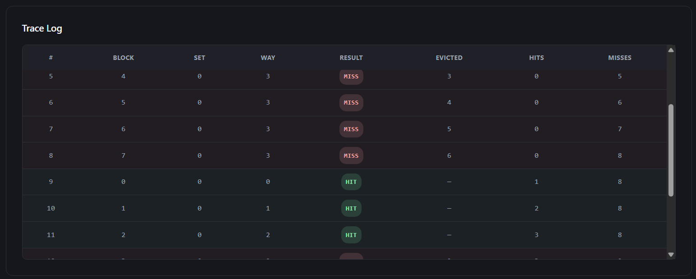

This table shows the history of the simulation sequence for each accesses made. It stores the following information: # of the sequence, block accessed, set and way stored/found, result if it's a cache hit or miss, evicted block if it misses, and # of hits and misses currently at that call.

# How To Use

[Video Walkthrough](https://www.youtube.com/watch?v=k4wdMjGY5P8)

1. Set the Cache Line Size. This will determine the miss penalty and will have an effect on the average and total access times.
2. Set the Cache Blocks. This will determine n for sequences that require n like Sequential (2n, x2). This also determines how many blocks are in the set and how many blocks are there overall in the cache.
3. Set the Test Sequence. This will determine what sequence will be used for the simulation.
4. Choose an Algorithm.
5. Set the View Mode.
6. Press Start.
7. If you chose Step-by-Step for the View Mode in Step #5, then you can use the controller to scrub through the simulation.
8. Once done, try new configurations and restart the simuation to see the results.

# Misc

## React + Vite

This template provides a minimal setup to get React working in Vite with HMR and some ESLint rules.

Currently, two official plugins are available:

- [@vitejs/plugin-react](https://github.com/vitejs/vite-plugin-react/blob/main/packages/plugin-react) uses [Oxc](https://oxc.rs)
- [@vitejs/plugin-react-swc](https://github.com/vitejs/vite-plugin-react/blob/main/packages/plugin-react-swc) uses [SWC](https://swc.rs/)

### React Compiler

The React Compiler is enabled on this template. See [this documentation](https://react.dev/learn/react-compiler) for more information.

Note: This will impact Vite dev & build performances.

### Expanding the ESLint configuration

If you are developing a production application, we recommend using TypeScript with type-aware lint rules enabled. Check out the [TS template](https://github.com/vitejs/vite/tree/main/packages/create-vite/template-react-ts) for information on how to integrate TypeScript and [`typescript-eslint`](https://typescript-eslint.io) in your project.
